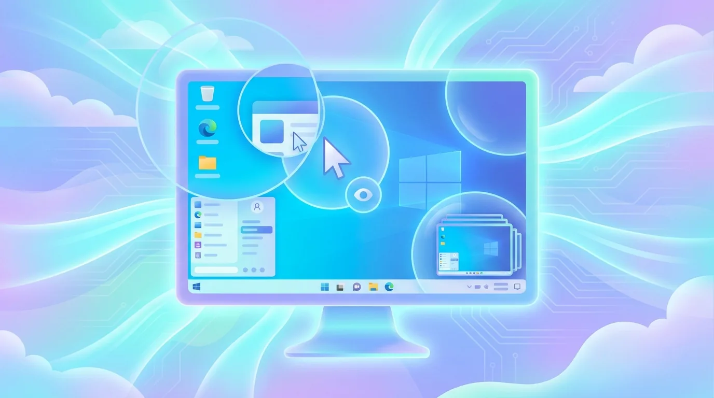
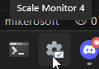
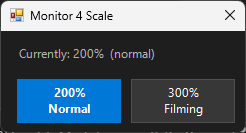

#  scale-monitor

Flip one monitor between 200% and 300% scaling with a single click

Windows

<!-- media: hero -->
<!--  -->
<!-- /media: hero -->

## What it is

I bump my monitor up to 300% scaling when I'm filming, then back to 200% for normal use. This is a little popup that does it in one click instead of digging through Display settings.

The change applies straight away, no signing out or rebooting.

It's set up for my HG584T05 monitor on Display 4. You'll need to change the monitor settings in the script to suit your own setup. The popup also has 350% and 400% buttons.

## Get it

Paste this into your AI coding agent (Claude Code, Codex, Cursor...):

> Clone https://github.com/mikecann/scale-monitor and make it my own. It's one of Mike
> Cann's personal tools, so read the README first, change anything specific to his
> setup to suit mine, then help me get it running.

### Or set it up by hand

You'll need Windows, Git, Windows PowerShell 5.1 and Windows Script Host (`wscript.exe`). There are no packages to download, API keys or `.env` settings.

```powershell
git clone https://github.com/mikecann/scale-monitor.git
cd scale-monitor
```

Before launching it, update `$regKey` and the `\\.\DISPLAY4` device name in `scale-monitor.ps1` for your monitor. See [Monitor settings](#monitor-settings) below.

```powershell
powershell -NoProfile -ExecutionPolicy Bypass -File .\install.ps1
```

This creates `C:\dev\tools\Scale Monitor.lnk` and a **Scale Monitor** shortcut in your user Start Menu. Both launch through the VBS wrapper so no console window flashes. Right-click the shortcut in `C:\dev\tools` and choose **Pin to taskbar**. PATH changes and administrator access aren't required if you can write to that folder.

To use a different shortcut folder:

```powershell
.\install.ps1 -ToolsDir "$env:USERPROFILE\Tools"
```

Keep the clone where it is after installing. The shortcuts point at its files, so pulling updates doesn't need a reinstall. If you move the clone, run the installer again.

## Using it

Click the taskbar shortcut, search for **Scale Monitor** in Start, or launch from the clone:

```powershell
wscript.exe .\scale-monitor.vbs
```

The popup appears near the bottom-right of the primary screen and shows the current scale. Click **200%**, **300%**, **350%** or **400%** to apply it and close the popup. Press Escape or click outside to close it without changing anything.

## Screenshots





## Monitor settings

The monitor registry key and display device are hardcoded in `scale-monitor.ps1`:

```powershell
$regKey = "HKCU:\Control Panel\Desktop\PerMonitorSettings\RTK8405_0C_07E9_97^C9A428C8B2686559443005CCA2CE3E2E"
# In Apply-Scale:
[WinApi]::ChangeDisplaySettingsEx("\\.\DISPLAY4", ...)
```

List the per-monitor keys on your Windows machine with:

```powershell
Get-ChildItem 'HKCU:\Control Panel\Desktop\PerMonitorSettings' |
    ForEach-Object { Get-ItemProperty -LiteralPath $_.PSPath -Name DpiValue }
```

Use Windows Display settings to identify the right monitor and compare its registry value before and after changing the scale. Update both the registry key and device name together, plus the popup labels if your display number is different. The `DpiValue` mapping below is for my monitor, so check it against Display settings for yours.

## How it works

Sets `DpiValue` in the per-monitor registry key for this display, then broadcasts `WM_SETTINGCHANGE` and calls `ChangeDisplaySettingsEx` with `CDS_RESET` to apply the new DPI live.

| DpiValue | Scale on my monitor |
| --- | --- |
| 4 | 200%, normal use |
| 7 | 300%, filming |
| 8 | 350% |
| 9 | 400% |

## Troubleshooting

If the registry key isn't there, check that the monitor is connected and `$regKey` matches your machine. The script's missing-monitor error path currently tries to show a message box before loading WinForms, so it may stop with a PowerShell error instead. Run it directly to see errors:

```powershell
powershell -NoProfile -ExecutionPolicy Bypass -File .\scale-monitor.ps1
```

If the scale doesn't change, check the device name and registry values against Windows Display settings. The popup labels are written for my setup, including the default label for unrecognised values.

## Uninstall

```powershell
powershell -NoProfile -ExecutionPolicy Bypass -File .\uninstall.ps1
```

Pass the same `-ToolsDir` if you used a custom folder. This removes the two shortcuts only while they still point at this clone. It leaves other tools and your monitor settings alone. Unpin the taskbar entry manually if needed.

## Development

These checks work with `pwsh` on macOS as well as Windows. The installer tests use temporary directories and mock Windows COM, so they don't create real shortcuts or change display settings.

```powershell
pwsh -NoProfile -File .\scripts\check-syntax.ps1
pwsh -NoProfile -File .\tests\install.Tests.ps1
```

CI runs both checks under Windows PowerShell 5.1. Real shortcut creation, silent launching and DPI changes still need a Windows machine with the target monitor attached.

## More tools

You can find my other tools at [mikerosoft.app](https://mikerosoft.app).

MIT licensed.
